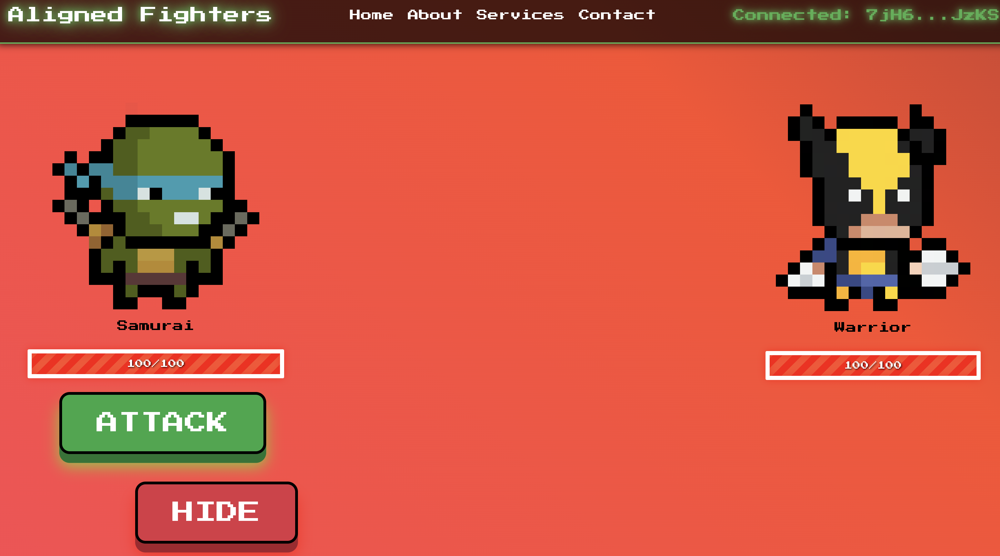
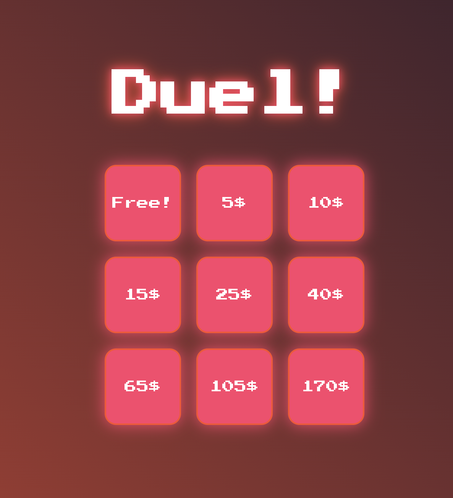
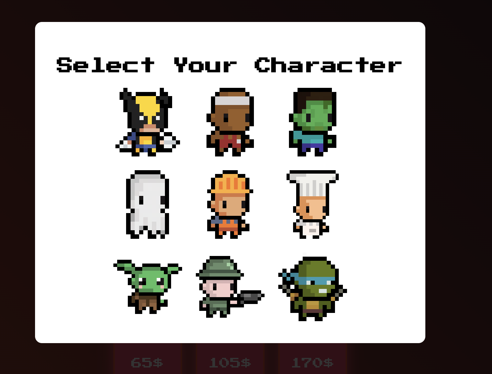
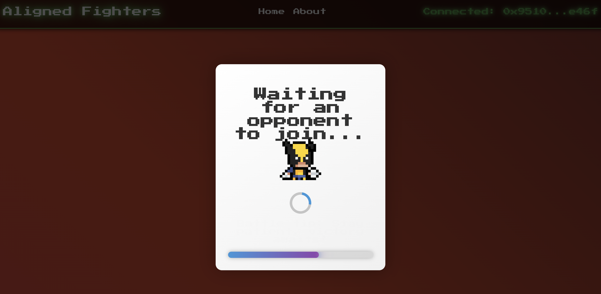
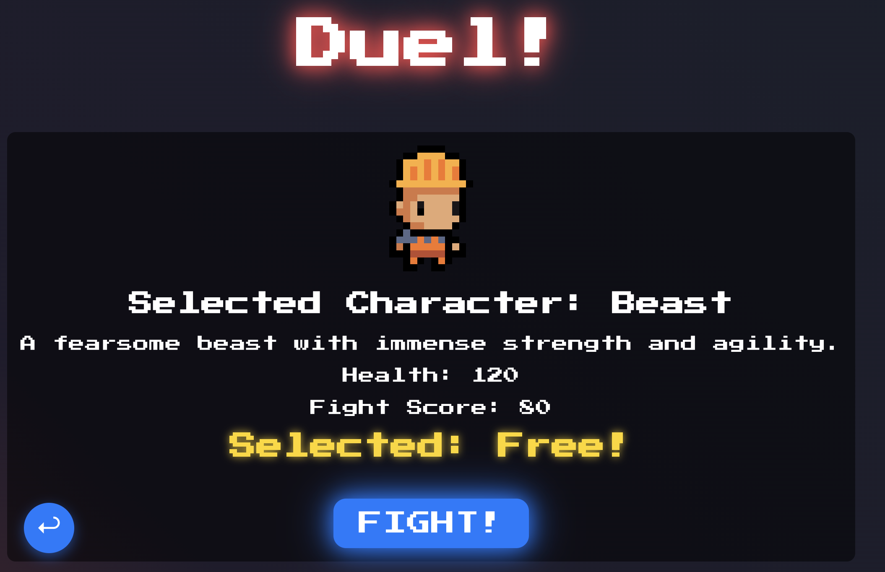

# Aligned Fighters

Welcome to **Aligned Fighters**, a thrilling multiplayer online game where you stake real value to duel other players in a high-stakes battle of strategy and chance. Engage in intense turn-based combat, leverage the unpredictability of attacks, and outsmart your opponent to claim victory. Winners earn the staked amount and mint a unique NFT as a token of their triumph, all secured through zero-knowledge proofs on the Ethereum Holesky testnet via the Aligned Layer protocol.

 It's LIVE at : [Aligned Fighters](https://aligned-duel.vercel.app/)





## Table of Contents

- [Description](#description)
- [Installation and Setup Guide](#installation-and-setup-guide)
- [Game Mechanics](#game-mechanics)
- [Quick Start](#quick-start)
- [Architecture](#architecture)
- [Project Structure](#project-structure)
- [Contributing](#contributing)
- [License](#license)

---

## Description

**Aligned Fighters** is a blockchain-integrated multiplayer game built with React on the frontend and Rust on the backend. Players stake real value to engage in strategic turn-based duels. Each action is recorded and verified using zero-knowledge proofs (zk-SNARKs) to ensure fairness and integrity. Winners claim the staked amount and mint a unique NFT, with all transactions processed on the Ethereum Holesky testnet via the Aligned Layer protocol.


### Features


- **Stake-Based Duels**: Players can stake various amounts or play for free.
- **Turn-Based Combat**: Engage in strategic battles with attack and hide options.
- **Chance-Based Outcomes**: Attacks have a 60% chance of success, hides have strategic benefits.
- **Zero-Knowledge Proofs**: Game integrity verified using zk-SNARKs with the SP1 prover.
- **Blockchain Integration**: Transactions and NFT minting on the Ethereum Holesky testnet via Aligned Layer.
- **Unique NFTs for Winners**: Victorious players mint exclusive NFTs as trophies.

---

## Quick Start

You can directly play at [Aligned Fighters](https://aligned-duel.vercel.app/)


## Installation and Setup Guide

### Prerequisites

- **Node.js and npm**: For running the frontend React application.
- **Rust and Cargo**: For building and running the backend server and zk program.
- **Ethereum Wallet**: Required for blockchain interactions (e.g., MetaMask).
- **Aligned SDK**: Ensure you have the Aligned SDK installed for zk-SNARK functionalities.
- **SP1 Prover**: Required for proof generation.
- **Foundry**: For verifier contract deployment

### Clone the Repository

```bash
git clone https://github.com/codekaya/Aligned_duel
cd aligned_duel
```
### Frontend Setup

1.  **Navigate to the frontend directory:**

```bash
    cd aligned_fighters_frontend
```

2.  **Install dependencies:**

```bash
    npm install
```

3.  **Start the React application:**

```bash
    npm start
```

The application should now be running at `http://localhost:3000`.


### zk Program Setup

### Requirements

1. [Rust](https://www.rust-lang.org/tools/install)
2. [Foundry](https://getfoundry.sh)

## Usage

### 1 - Create Keystore

You can use cast to create a local keystore.
If you already have one you can skip this step.

```bash
cast wallet new-mnemonic
```

Then you can import your created keystore using:

```bash
cast wallet import --interactive <path_to_keystore.json>
```

Then you need to obtain some funds to pay for gas and proof verification.
You can do this by using this [faucet](https://cloud.google.com/application/web3/faucet/ethereum/holesky)

### 2 -  Fight

to run the program
```bash
make aligned_fight KEYSTORE_PATH=<path_to_keystore.json>
```

This will:

1. Fight with each other
2. Generate ZK proof
3. Pay & submit proof to aligned for verification
4. Wait for proof to be verified in aligned
5. Claim NFT and staked amount if proof is verified
    This will generate the ELF file needed for proof generation.

* * * * *


### Main Screen



### Character selection



### Waiting for Opponent



### Pre-Game Screen




Game Mechanics
--------------

### Character Selection and Staking

-   **Stake Selection**: Players choose an amount to stake or opt for a free game.
-   **Character Choice**: Select from a roster of unique characters, each with distinct attributes.

### Battle Mechanics

-   **Turn-Based Actions**: Players take turns to perform actions.
-   **Available Actions**:
    -   **Attack**:
        -   **Success Rate**: 60% chance of a valid attack.
        -   **Effect**: Successful attacks reduce the opponent's health based on attack power.
    -   **Hide**:
        -   **Effect**: If chosen, there is a 40% chance that the next attack from the opponent will be reversed back to them.
-   **Winning the Game**:
    -   **Victory Condition**: Reduce your opponent's health to zero while surviving.
    -   **Rewards**:
        -   **Staked Amount**: Winner takes the combined staked amount.
        -   **NFT Minting**: Winners can mint a unique NFT as a trophy.

### Game Integrity and Proof Verification

-   **Action Recording**: All player actions are stored on the Rust backend.
-   **Zero-Knowledge Proofs**:
    -   **Proof Generation**: After the game, the backend uses the SP1 prover to generate a zk-SNARK proof, verifying the game was played according to the rules.
    -   **Aligned Layer Verification**: The proof is sent to the Aligned Layer for verification.
    -   **Blockchain Interaction**: Upon successful verification, the proof is submitted to the Ethereum Holesky testnet.

* * * * *
Quick Start
-----------

1.  **Launch the Frontend and Backend**:

    -   Start both the frontend and backend servers as per the setup guide.
2.  **Access the Game**:

    -   Open your browser and navigate to <http://localhost:3000>.
3.  **Connect Your Wallet**:

    -   Click on the "Connect Wallet" button to link your MetaMask wallet.
    -   Ensure your MetaMask is configured to the Ethereum Holesky testnet.
4.  **Select a Stake Amount and Character**:

    -   Choose an amount to stake or opt for a free game.
    -   Select your character and enter the battle arena.
5.  **Wait for an Opponent**:

    -   The game will start once another player joins.
6.  **Engage in Battle**:

    -   Use the **Attack** and **Hide** buttons strategically.
    -   Remember the attack and hide probabilities:
        -   **Attack**: 60% chance of success.
        -   **Hide**: 40% chance to reflect the next attack back to the opponent.
7.  **Win and Claim Rewards**:

    -   If you win, the backend will generate a zk-SNARK proof.
    -   Upon verification, you will receive the staked amount and can mint a unique NFT.

* * * * *

Architecture
------------

### Overview

The project consists of three main components:

1.  **Frontend (React)**:

    -   **User Interface**: Interactive UI for game interaction and wallet connectivity.
    -   **WebSocket Communication**: Real-time updates via WebSocket connection to the backend.
    -   **MetaMask Integration**: Connect to MetaMask for Ethereum interactions on the Holesky testnet.
2.  **Backend (Rust with Actix-Web)**:

    -   **Game Server**: Handles game logic, player actions, and maintains game state.
    -   **WebSocket Server**: Facilitates real-time communication with the frontend.
    -   **Proof Generation**: Uses the SP1 prover to generate zk-SNARK proofs after each game.
3.  **zk Program (Rust, no_std)**:

    -   **Game Verification**: Validates the integrity of the game using the recorded actions.
    -   **Zero-Knowledge Proofs**: Ensures that the game was played fairly without revealing private data.
    -   **Aligned Layer Integration**: Interacts with the Aligned Layer for proof verification.

### Data Flow

1.  **Player Actions**:

    -   Players send actions (attack or hide) to the backend via WebSockets.
    -   The backend updates the game state and broadcasts it to both players.
2.  **Game State Management**:

    -   The backend maintains the state of the game, including player health and actions.
    -   All actions are recorded for proof generation.
3.  **Proof Generation and Verification**:

    -   Upon game completion, the backend uses the SP1 prover to generate a zk-SNARK proof of the game's validity.
    -   The proof is sent to the Aligned Layer for verification.
    -   If verified, the proof is submitted to the Ethereum Holesky testnet.
4.  **Reward Distribution**:

    -   The winner receives the staked amount.
    -   An NFT is minted on the Holesky testnet as a trophy for the winner.
* * * * *

Project Structure
-----------------
```bash

aligned-fighters/
├── aligned_fighters_frontend/    # React application
│   ├── src/
│   │   └── App.js     # Main React component
│   └── package.json   # Frontend dependencies
|
├── zk_program/script        # zk-SNARK program
│   ├── src/
│   │   └── main.rs    # zk program code
│   └── Cargo.toml     # zk program dependencies
├── README.md          # Project README
└── LICENSE            # Project license
```
* * * * *

Contributing
------------

We welcome contributions from the community! Here's how you can help:

-   **Report Bugs**: If you find a bug, please open an issue with detailed information.
-   **Submit Pull Requests**: Fork the repository, make your changes, and submit a pull request.
-   **Feature Requests**: Have an idea for a new feature? Open an issue to discuss it.

### Development Setup

1.  **Fork and Clone the Repository**

   ```bash

    git clone https://github.com/codekaya/Aligned_duel
```
2.  **Create a New Branch**

```

    git checkout -b feature/my-new-feature
```

3.  **Make Your Changes**

4.  **Commit and Push**

```bash

    git add .
    git commit -m "Add my new feature"
    git push origin feature/my-new-feature
```

5.  **Submit a Pull Request**

* * * * *

## License

[Apache-2.0](LICENSE)